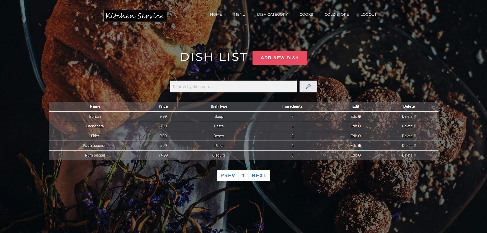
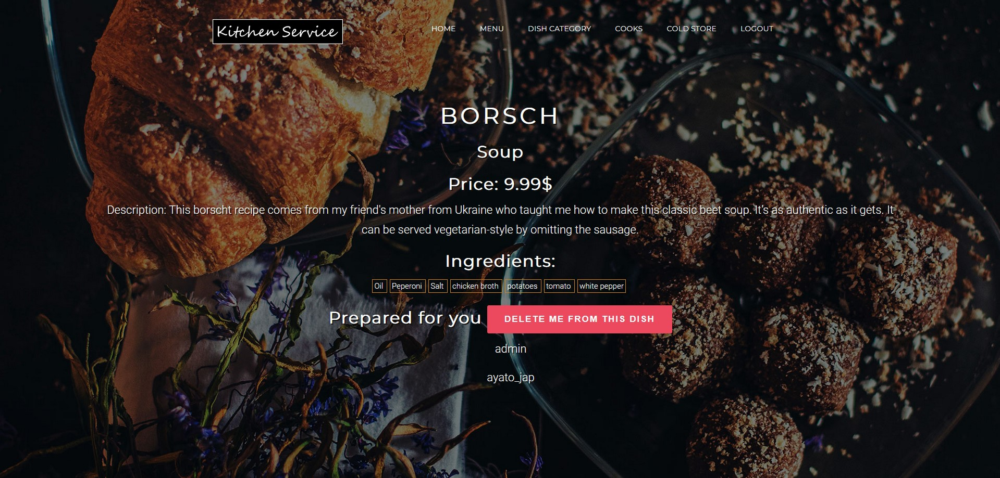
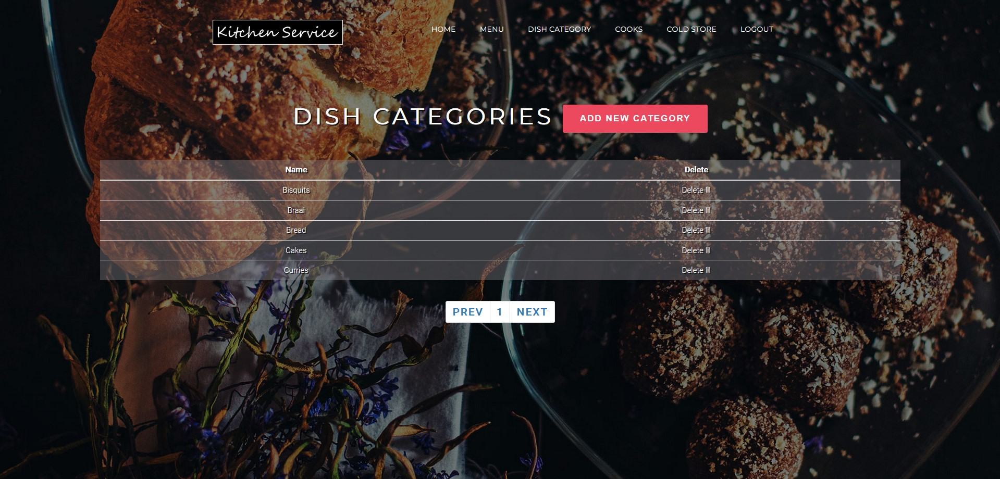
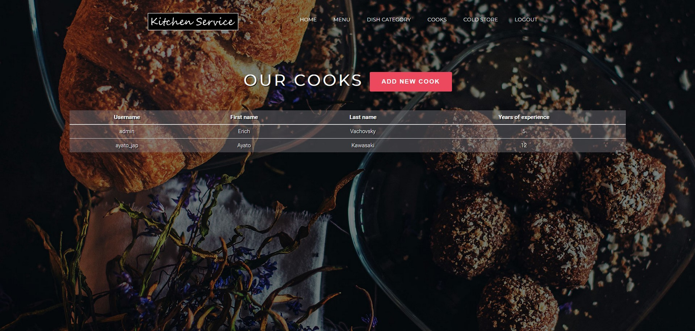
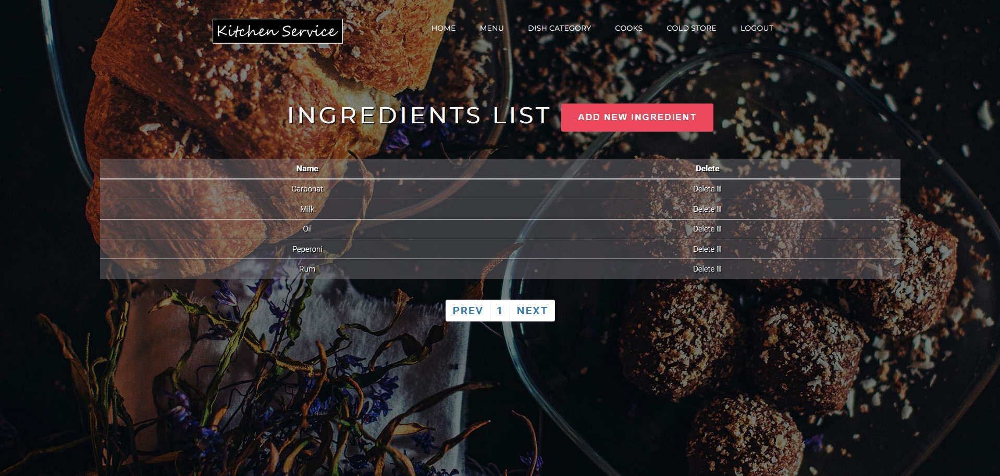

# Kitchen service
Django project for managing cooks and dishes on kitchen

## Check it out!
[Kitchen service deployed to Render](https://kitchen-service-m1mo.onrender.com)

## Built With
* [Python](https://www.python.org/) - The project worked on this
* [Django](https://www.djangoproject.com/) - The project is based on this
* [Bootstrap](https://getbootstrap.com/) - Used to project looks better
### Demo






#### Installation
Python3 must be already installed!
```shell
git clone https://github.com/yaroslav-demchenko/kitchen-service
cd kitchen-service
python3 -m venv venv
venv\Scripts\activate (on Windows)
source venv/bin/activate (on macOS)
pip install -r requirements.txt
python manage.py migrate #create data base
python manage.py runserver # starts Django server
```
